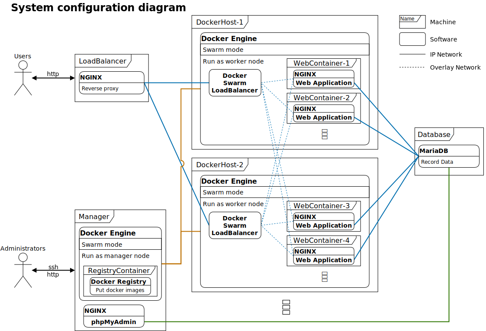

# DevelopmentalBase-webapplication

This repository is template repository for web application development with using virtual machine and docker container.



## Requirements

* rsync
* Vagrant
* Vagrant Plugins
  * [vagrant-hostmanager][vagrant-hostmanager]
  * [vagrant-scp][vagrant-scp]
* VirtualBox or Hyper-V
* DHCP server (when use Hyper-V)

## How to use

### Make use as a template

You can generate new repository with [`Use this template`][use-template] Button in this repository page.

### Launch system

#### VirtualBox Users

1. Generate `.env` file with coping `.env.example`.
    ```bash
    cp ./.env.example ./.env
    ```
1. Modify `.env` file as you like.
1. Run command, `vagrant up`.

If you do not install required vagrant plugins, you need operate with install dialog when you run command `vagrant up`.
After the installs have finished, run command `vagrant up` again.

#### Hyper-V Users

writing....

## Dependencies

* Vagrant
  * Vagrant Cloud
    * [generic/centos8][vagrant-centos8]
  * [vagrant-hostmanager][vagrant-hostmanager]
  * [vagrant-scp][vagrant-scp]
* Ansible(Python3)
* Docker
  * Docker Engine
  * Docker Compose
  * Docker Swarm
  * Docker Hub
    * [centos:centos8][docker-centos] (Docker Official Image)
* NGINX
* MariaDB
* phpMyAdmin

## License

See the included [LICENSE.md](./LICENSE.md) file for more details.

<!-- URL links -->
[use-template]:https://github.com/shirataki1126/DevelopmentalBase-webapplication/generate
[vagrant-hostmanager]:https://github.com/devopsgroup-io/vagrant-hostmanager
[vagrant-scp]:https://github.com/invernizzi/vagrant-scp
[vagrant-centos8]:https://app.vagrantup.com/generic/boxes/centos8
[docker-centos]:https://hub.docker.com/_/centos
